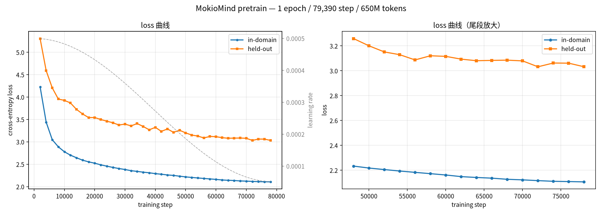

# MokioMind_xyavid

一个从零训练的中文小语言模型（仅做了预训练），基于minimind仓库和mokiomind的仓库与视频自行复现。

| | |
|---|---|
| 参数量 | 25.8 M |
| 架构 | 8 层 / hidden 512 / 8 个 Q 头、2 个 KV 头（GQA）/ head_dim 64 |
| 组件 | RoPE（支持 YaRN 缩放）、RMSNorm、SwiGLU、embedding 与 lm_head 权重共享 |
| 词表 | 6400（`Model/tokenizer.json`） |
| 语料 | 1,270,238 条中文文本，约 650 M token |
| 训练 | 1 个 epoch / 79,390 step / AdamW / bf16 混合精度 |

## 训练结果

### loss 曲线



| 指标 | 起始 | 结束 |
|---|---|---|
| in-domain | 4.229 | 2.106 |
| held-out | 5.306 | 3.032 |

held-out 指语料之外的自撰文本，作为泛化代理。

### 生成样例

固定 prompt、固定贪心解码，只让 checkpoint 变化（完整对比见 [`figures/samples_progression.txt`](figures/samples_progression.txt)）：

**prompt：人工智能的未来**

```
[step   2000] 人工智能的未来发展趋势是人工智能的，它将会在医疗、金融、金融、教育等。它将会对教育、教育、教育、教育等方面发挥着重要作用。…
[step  16000] 人工智能的未来发展趋势是什么？人工智能的未来发展趋势主要集中在以下几个方面：1. 自动化：人工智能将在医疗、金融、教育等领域发挥重要作用，提高医疗效率和准确性。…
[step  78000] 人工智能的未来发展方向是什么？人工智能的未来发展方向是更加智能化和自主化。人工智能的未来发展方向包括以下几个方面：1. 更加智能化：人工智能将会更加智能化，…
```

**prompt：如何学习编程**（step 78000）

```
如何学习编程？学习编程需要掌握一些基本概念，例如变量、循环、条件语句、循环语句等。此外，还需要掌握一些编程技巧，例如使用变量、循环语句、函数等。
```

早期（step 2000）表现为短语级重复，随训练推进逐步出现条目结构与主题延续；因模型规模与训练量有限，仍残留局部循环与事实错误。

其它图件：[权重演化总览](figures/fig_overall_weights.png)。

## 快速开始

```bash
uv sync
```

预训练（单卡）：

```bash
mkdir -p logs
.venv/bin/python Trainer/train_pretrain.py \
  --batch_size 16 \
  --accumulation_steps 4 \
  --epochs 1 \
  --max_seq_len 512 \
  --save_interval 2000 \
  --log_interval 100 \
  --num_workers 4 \
  2>&1 | tee logs/pretrain_v1.log
```

- 权重输出到 `out/`，断点续训状态输出到 `checkpoints/`（`--from_resume 1` 续训，需保持 `--epochs` 不变）。
- 建议带 `| tee` 保留日志，之后可用 `Tools/plot_log.py` 画 loss / lr 曲线。
- 8 GB 显存的机器上请用 `--batch_size 16`（或更小）；默认的 32 会触发显存耗尽并大幅降速。

## 目录

```
Model/        模型定义与 tokenizer
Trainer/      训练脚本（train_pretrain.py）与通用工具
dataset/      预训练语料与 Dataset 实现
figures/      训练结果图件
```

